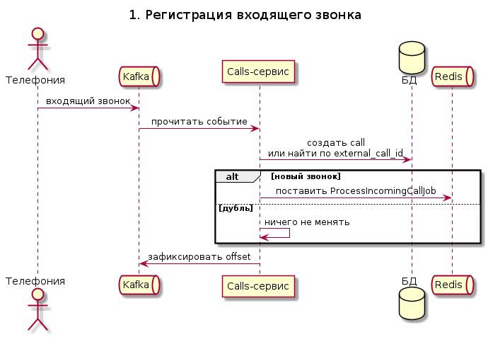
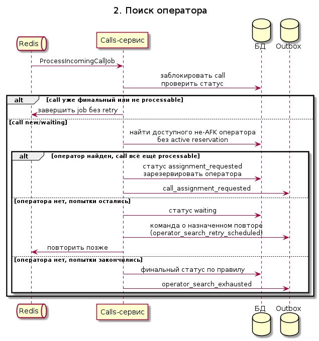
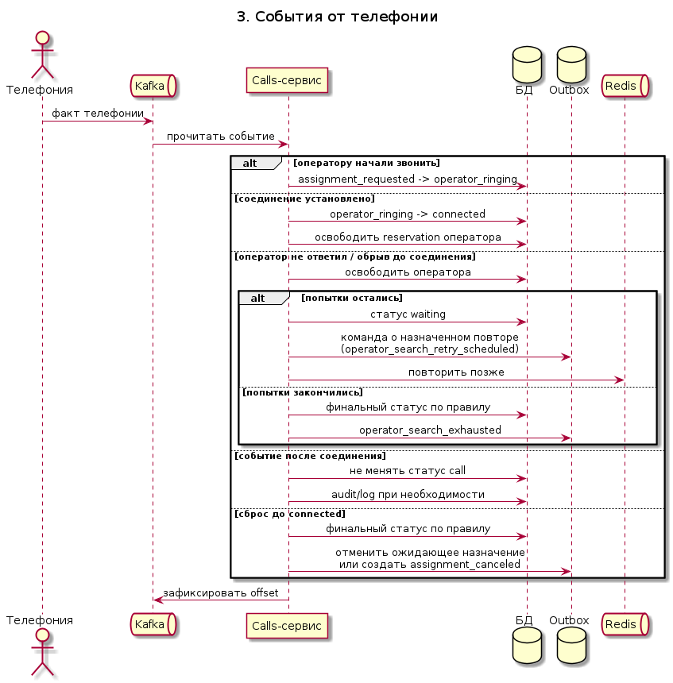
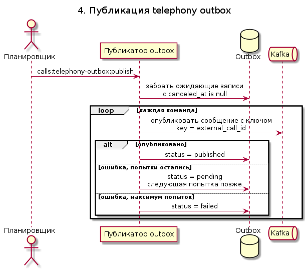
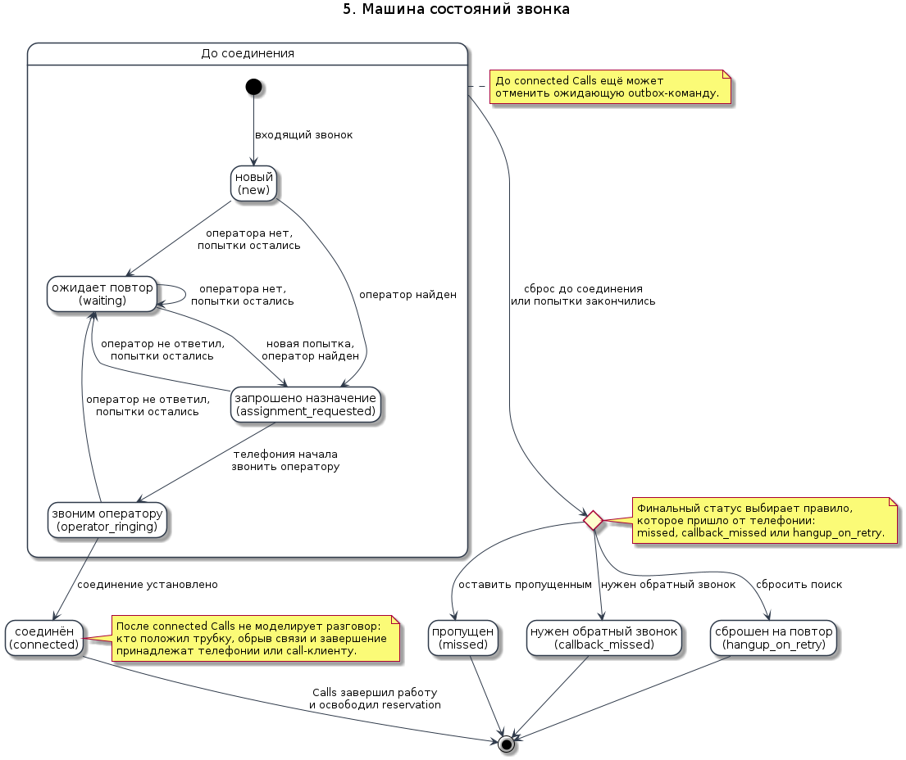

# Архитектура

Проект разделён на слои с ориентацией на hexagonal architecture:

- `src/Domain` - доменные объекты, value objects и domain events без зависимости от фреймворка;
- `src/Application` - use cases и порты; слой не зависит от Laravel и Infrastructure;
- `src/Infrastructure` - реализации application-портов через Laravel, БД, очереди и внешние интеграции;
- `app` - Laravel wiring: jobs, providers, HTTP/console entrypoints.

## Предметные области application-слоя

- `Application\Calls` - lifecycle звонка до `connected`, команды обработки и call state machine.
- `Application\Clients` - read-side lookup клиента. Сейчас это shared DB adapter, позже сервис или Kafka read model.
- `Application\Operators` - локальная reservation оператора на время назначения. Фактические `available/afk` приходят из внешней read model.
- `Application\Telephony` - команды в Telephony, outbox delivery и publisher ports.
- `Application\Shared` - общие инфраструктурные порты: транзакции, event bus, queue bus, console runner, metrics, DLQ.

## CQRS-порты

Порты разделены по намерению:

- `CallReadRepository` - чтение call без блокировки для lookup-сценариев;
- `CallWriteRepository` - создание call, `findForUpdate`, сохранение state machine;
- `ClientReadRepository` - read-side lookup клиента по телефону;
- `OperatorReservationRepository` - write-side reservation/release оператора для call;
- `TelephonyCommandOutboxWriter` - запись исходящих команд и отмена pending assignment;
- `TelephonyCommandOutboxReader` - проверка опубликованного assignment;
- `TelephonyOutboxWriteRepository` - claim/mark delivery records; claim считается write-side операцией;
- `TelephonyCommandPublisher` - transport publisher.

Текущие Eloquent adapters могут реализовывать несколько портов сразу. Важна не физическая таблица, а application-контракт: handler зависит только от read или write роли, которая ему нужна.

Правило Repository:

- repository на выходе возвращает только объект из `Domain`: aggregate, domain model, value object или список domain objects;
- repository не возвращает DTO, Query object, read-model class, Eloquent model, `stdClass`, `Collection` или scalar id;
- если application-слою нужен идентификатор, repository возвращает VO (`CallId`, `ClientId`, `OperatorId`) или доменную модель, из которой application уже берёт scalar на своей границе;
- raw DB records, arrays и Eloquent остаются внутри `Infrastructure`;
- исключение: write-методы без результата возвращают `void`.

Текущие контракты:

- `CallReadRepository::findByExternalCallId(ExternalCallId): ?Call`;
- `CallWriteRepository::createIncomingFromKafka(...): Call`;
- `CallWriteRepository::findForUpdate(...): ?Call`;
- `ClientReadRepository::findIdByPhone(PhoneNumber): ?ClientId`;
- `OperatorReservationRepository::reserveAvailableForCall(CallId): ?OperatorReservation`;
- `TelephonyOutboxWriteRepository::claimDue(...): list<TelephonyOutboxMessage>`.

## Eloquent records и value objects

Eloquent models используются как raw persistence records:

- в моделях нет `casts()`;
- raw DB-значения собираются в domain value objects: `CallId`, `ExternalCallId`, `PhoneNumber`, `ClientId`, `OperatorId`, `OperatorSearchAttempts`, `OperatorSearchMaxAttempts`, `OperatorSearchRetryDelay`;
- даты представлены через `Domain\Shared\Timestamp`;
- `Infrastructure\*\Persistence\*Repository` не возвращает Eloquent records;
- mapping вынесен в infrastructure mapper-и: `EloquentCallMapper`, `EloquentClientMapper`, `EloquentOperatorMapper`, `EloquentTelephonyOutboxMapper`;
- repository возвращает `Domain` aggregate/model/VO: `Call`, `ClientId`, `OperatorReservation`, `TelephonyOutboxMessage`;
- domain/application не зависят от Eloquent casting, Carbon или Laravel model magic.

## Общие контракты

- `Domain\Shared\DomainEvent` - контракт доменного события.
- `Domain\Shared\AggregateRoot` - базовая запись и выдача доменных событий.
- `Application\Shared\Ports\DeadLetterQueue` - запись Kafka poison messages для ручного разбора.
- `Application\Shared\Ports\EventBus` - публикация доменных событий.
- `Application\Shared\Ports\KafkaConsumer` - transport boundary для чтения Kafka facts.
- `Application\Shared\Ports\QueueBus` - постановка асинхронных команд/jobs.
- `Application\Shared\Ports\TransactionManager` - транзакционная граница.

Laravel bindings находятся в `App\Providers\ArchitectureServiceProvider`:

- `EventBus` -> `Infrastructure\Shared\Bus\LaravelEventBus`
- `DeadLetterQueue` -> `Infrastructure\Shared\Kafka\EloquentDeadLetterQueue`
- `QueueBus` -> `Infrastructure\Shared\Bus\LaravelQueueBus`
- `KafkaConsumer` -> `Infrastructure\Shared\Kafka\JsonLinesKafkaConsumer`
- `TransactionManager` -> `Infrastructure\Shared\Persistence\DatabaseTransactionManager`

Kafka message contracts, topics, keys и idempotency описаны отдельно:
[`kafka-contracts.md`](kafka-contracts.md).

## Flow звонка

- Kafka - authoritative ingress для входящих звонков.
- Kafka consumer должен маппить сообщение в `RegisterIncomingCallFromKafkaCommand`.
- `HandleKafkaCallFactHandler` валидирует raw Kafka record, маппит его в application command и отправляет poison messages в DLQ.
- `external_call_id` - стабильный идентификатор звонка из Telephony/AMI; поле уникально в `calls`.
- `kafka_message_id` хранится как audit metadata.
- Kafka-события считаются уникальными, но локальная таблица `calls` дополнительно защищена unique constraint по `external_call_id`.
- Текущая реализация использует shared database: `calls`, `clients`, `operators`.
- `calls.client_id` и `calls.operator_id` пока являются локальными foreign keys.
- Будущее выделение сервисов должно заменить infrastructure adapters для `ClientReadRepository` и `OperatorReservationRepository` либо перевести их на локальные Kafka read models.
- Успешная регистрация публикует `Domain\Calls\Events\IncomingCallRegistered`.
- `CallProcessingQueue` ставит `ProcessIncomingCallJob`; job делегирует работу в `ProcessIncomingCallHandler`.
- Входящий звонок и повтор используют один use case поиска оператора.
- Правила повторов поиска оператора приходят от Telephony/Kafka и сохраняются на звонке: max attempts, retry delay seconds, hangup policy.
- Перед поиском оператора и перед фиксацией assignment handler проверяет, что call всё ещё `new` или `waiting`. Поздний job после `hangup` не должен резервировать оператора и писать outbox.
- Если оператора нет и попытки остались, call переходит в `waiting`, в `telephony_outbox` пишется `operator_search_retry_scheduled`, `CallProcessingRetryQueue` ставит новый `ProcessIncomingCallJob` в `calls-retry` с заданной задержкой.
- Если попытки исчерпаны, в `telephony_outbox` пишется `operator_search_exhausted`, финальный статус выбирается правилом.
- Если оператор найден, доступен, не AFK и не имеет активной reservation, call переходит в `assignment_requested`, в `operators.reserved_call_id` пишется id call, в `telephony_outbox` пишется `call_assignment_requested`.
- Telephony присылает факты обратно через Kafka: оператору звонят, соединение установлено, оператор не ответил, плечо оборвалось, звонок сброшен.
- События сброса от Telephony/Kafka маппятся в `MarkCallHungUpFromKafkaCommand` по `external_call_id`. Если call ещё `new`, `waiting`, `assignment_requested` или `operator_ringing`, финальный статус выбирается правилом: `missed`, `callback_missed`, `hangup_on_retry`.
- `connected` является успешным терминальным состоянием для Calls. В этот момент Calls очищает свою локальную `operators.reserved_call_id` и больше не моделирует разговор.
- События после `connected` не двигают state machine Calls. Клиент положил трубку, оператор завершил разговор, обрыв плеча или качество связи относятся к Telephony, SIP/call-client или отдельному сервису доступности операторов.

## Машина состояний

Текущие статусы:

- `new` - call зарегистрирован, поиск оператора ещё не начат;
- `waiting` - оператор не найден или предыдущая попытка назначения не состоялась, ждём следующую попытку;
- `assignment_requested` - оператор зарезервирован через `operators.reserved_call_id`, команда назначения записана в outbox;
- `operator_ringing` - Telephony начала дозвон оператору;
- `connected` - Telephony установила соединение клиента и оператора; для Calls это успешный терминал;
- `missed`, `callback_missed`, `hangup_on_retry` - финальные статусы из policy.

Переходы:

- `new/waiting -> assignment_requested` при найденном операторе;
- `assignment_requested -> operator_ringing` по событию Telephony;
- `assignment_requested/operator_ringing -> connected` по событию установленного соединения; при переходе Calls очищает локальную `operators.reserved_call_id`;
- `assignment_requested/operator_ringing -> waiting|final` по событию “оператор не ответил” или обрыву до соединения;
- `new/waiting/assignment_requested/operator_ringing -> final` по правилу сброса звонка.

Доменный объект `Domain\Calls\Call` владеет решением по переходам:

- `recordFailedOperatorSearchAttempt()` решает: поставить `waiting` и вернуть retry outcome или закрыть call финальным статусом;
- `recordSuccessfulOperatorSearchAttempt()` фиксирует попытку и переводит call в `assignment_requested` только если call ещё processable;
- `failPendingOperatorAssignment()` решает: повторить поиск или завершить поиск по правилу;
- application handlers не проверяют attempts и не выбирают финальный статус напрямую, а исполняют side effects по domain outcome.

Что происходит после `connected`:

- Calls не знает и не должен знать, кто завершил разговор;
- Calls не решает, может ли оператор сам прекратить разговор;
- Calls не применяет retry policy после установленного соединения;
- события после `connected` можно писать в технический audit/log, но они не меняют бизнес-статус call;
- актуальная доступность оператора должна приходить из call-клиента, Telephony, Operator Availability service или Kafka read model.

## Reservation оператора

- `operators.available` и `operators.afk` считаются read model внешнего состояния оператора.
- Calls не выставляет `available=true` при освобождении оператора, чтобы не объявить оператора свободным во время разговора.
- Calls владеет только локальной краткой бронью: `operators.reserved_call_id` и `operators.reserved_at`.
- Allocation выбирает оператора по условиям `available=true`, `afk=false`, `reserved_call_id is null`.
- Release очищает reservation только если `reserved_call_id` совпадает с текущим call id. Позднее событие по старому звонку не должно снять чужую новую бронь.
- На PostgreSQL/MySQL allocation использует `FOR UPDATE SKIP LOCKED`, чтобы параллельные workers не стояли в очереди за одним и тем же оператором.
- Просроченная reservation не очищается прямым `UPDATE operators`. Команда `calls:operator-reservations:release-expired` проводит компенсационный flow: call переводится в `waiting` или финальный статус по policy, reservation освобождается, в Telephony outbox пишется retry/exhausted и при необходимости `call_assignment_canceled`.

## Highload и конкуренция

Закрытые риски текущей реализации:

| Риск | Что сделано |
|---|---|
| Несколько workers выбирают одного оператора | Allocation идёт в транзакции, выбранный оператор блокируется, на PostgreSQL/MySQL используется `FOR UPDATE SKIP LOCKED` |
| Lock wait при большом числе workers | Горячие выборки operator allocation и outbox claim не ждут уже заблокированные строки на PostgreSQL/MySQL |
| Плохой план query на operator allocation | Добавлен составной индекс `operators_allocation_idx` |
| Зависшая reservation после потери/задержки Telephony facts | Добавлен compensation command `calls:operator-reservations:release-expired` |
| Поздний queue job после `hangup` | Перед allocation и перед assignment проверяется processable-статус call; финальный call пропускается без reservation/outbox |
| Retry storm при массовом отсутствии операторов | Redis retry queue применяет `min_delay + jitter` и верхний cap к фактической задержке job |
| Outbox publisher конфликтует при параллельных workers | Claim outbox использует row lock + `SKIP LOCKED` на PostgreSQL/MySQL |
| Publisher умер после claim и оставил outbox в `processing` | `processing_started_at` + команда `calls:telephony-outbox:requeue-stale` возвращает stale records в `pending` |
| Recovery-команды есть, но не запускаются автоматически | Laravel scheduler запускает publish/requeue/cleanup каждую минуту |
| Непонятно, где растёт backlog | `calls:metrics:snapshot` пишет gauges по calls/outbox/reservations/queues; hot paths пишут counters/timings |
| Poison messages в будущих Kafka consumers теряются или бесконечно ломают consumer group | Добавлен порт `DeadLetterQueue` и локальная таблица `dead_letter_messages` |
| Медленный claim due outbox records | Добавлен составной индекс `telephony_outbox_claim_due_idx` |
| Медленный lookup опубликованного assignment для cancel logic | Добавлен индекс `telephony_outbox_assignment_lookup_idx` |
| Рост retry/due scans | Добавлен индекс `calls_retry_due_idx` |

Retry queue backpressure:

- Domain и Telephony policy задают базовую задержку поиска оператора.
- В `telephony_outbox` пишется именно базовая policy-delay, чтобы внешняя система видела правило без инфраструктурного шума.
- `LaravelCallProcessingRetryQueue` применяет операционную задержку для Redis job: `max(policy_delay, OPERATOR_SEARCH_RETRY_MIN_DELAY_SECONDS) + random(0..OPERATOR_SEARCH_RETRY_JITTER_SECONDS)`, затем cap `OPERATOR_SEARCH_RETRY_MAX_DELAY_SECONDS`.
- Это разводит массовые retry по времени и защищает Redis/DB от синхронной волны.

Что остаётся внешним или следующим этапом:

- native Kafka producer вместо console producer для batching/compression/delivery reports;
- отдельный Dispatch / Routing service, если allocation станет главным bottleneck;
- Kafka inbox, если источник перестанет гарантировать уникальность событий;
- внешние метрики Kafka lag и DB lock wait: их лучше снимать на уровне Kafka/PostgreSQL exporter, не из application code.

## Метрики

Application-слой зависит только от `Application\Shared\Ports\Metrics`.

Текущий adapter:

- `Infrastructure\Shared\Observability\LaravelLogMetrics`;
- пишет structured log `metric` с полями `type`, `name`, `value`, `tags`;
- заменяется binding-ом на Prometheus/StatsD/OpenTelemetry adapter без правки use cases.

Counters/timings на hot path:

| Метрика | Тип | Где пишется |
|---|---|---|
| `call_processing.skipped` | counter | call не найден или уже не processable |
| `call_processing.duration_ms` | timing | обработка call с tag `result` |
| `operator_assignment.requested` | counter | найден оператор и создан assignment request |
| `operator_search.retry_scheduled` | counter | поиск оператора ушёл в retry |
| `operator_search.exhausted` | counter | попытки поиска исчерпаны, tag `final_status` |
| `call_retry.enqueued` | counter | job поставлен в `calls-retry` |
| `call_retry.delay_seconds` | gauge | фактический delay после min/jitter/cap |
| `telephony_outbox.claimed` | counter | outbox publisher claim-нул records |
| `telephony_outbox.published` | counter | outbox records опубликованы |
| `telephony_outbox.publish_failed` | counter | публикация outbox record завершилась ошибкой |
| `telephony_outbox.publish_duration_ms` | timing | одна итерация outbox publisher |
| `telephony_outbox.stale_requeued` | counter | stale `processing` records возвращены в `pending` |
| `telephony_outbox.stale_requeue_duration_ms` | timing | одна итерация stale requeue |
| `dead_letter.recorded` | counter | DLQ record записан или продедуплицирован, tags `source/topic/reason/result` |
| `kafka_consumer.message_received` | counter | raw Kafka record принят mapper-ом |
| `kafka_consumer.message_handled` | counter | Kafka fact применён application handler-ом, tags `source/topic/type/schema_version` |
| `kafka_consumer.message_failed` | counter | handler упал при обработке Kafka fact |
| `kafka_consumer.message_dlq` | counter | Kafka fact отправлен в DLQ |
| `kafka_consumer.message_duration_ms` | timing | обработка одного Kafka fact |
| `operator_reservation.expired_released` | counter | просроченные reservation обработаны |
| `operator_reservation.expired_retried` | counter | просроченные reservation ушли в retry |
| `operator_reservation.expired_finalized` | counter | просроченные reservation закрыли call финально |
| `operator_reservation.release_expired_duration_ms` | timing | одна итерация cleanup |

Snapshot gauges:

| Метрика | Tags | Источник |
|---|---|---|
| `calls.depth` | `status` | `calls` grouped by status |
| `telephony_outbox.depth` | `status` | `telephony_outbox` grouped by status |
| `dead_letter.depth` | `reason` | unresolved `dead_letter_messages` grouped by reason |
| `operator_reservation.active` | none | `operators.reserved_call_id is not null` |
| `operator_reservation.expired` | none | active reservations старше TTL |
| `queue.depth` | `queue=calls/calls-retry` | Laravel queue connection size |

`calls:metrics:snapshot` запускается scheduler-ом каждую минуту.

## Зоны ответственности сервисов

Текущая реализация:

| Компонент | Статус | Ответственность | Выход наружу | Не делает |
|---|---|---|---|---|
| Calls | реализовано | Регистрирует call, дедуплицирует по `external_call_id`, хранит state machine до `connected`, исполняет поиск/повтор поиска оператора, держит локальную reservation | Domain event `IncomingCallRegistered`, jobs, команды в `telephony_outbox` | Не звонит оператору сам, не управляет SIP, не моделирует разговор после `connected` |
| Telephony outbox publisher | реализовано | Доставляет команды из `telephony_outbox` в Kafka, claim-ит due records, возвращает stale `processing` records в `pending` отдельной командой | Kafka messages с `external_call_id` как key и `idempotency_key` | Не принимает бизнес-решения |
| Redis queue | реализовано | Локальная async-очередь Calls для обработки и delayed retry поиска | `ProcessIncomingCallJob` в очередях `calls` и `calls-retry` | Не является межсервисной шиной данных |
| DLQ | реализовано как локальная таблица | Хранит Kafka poison messages для ручного разбора и повторного решения | `dead_letter_messages`, metric `dead_letter.depth` | Не заменяет Kafka inbox и не применяет сообщения автоматически |
| Kafka consumer port | реализовано: JSONL + rdkafka adapters | Даёт runtime boundary для чтения facts и передачи в `HandleKafkaCallFactHandler` | `calls:kafka:consume` | JSONL только для smoke/test; rdkafka требует PHP extension |
| Reservation cleanup | реализовано | Компенсирует просроченные operator reservations и продолжает retry/finalization flow | `operator_search_retry_scheduled`, `operator_search_exhausted`, `call_assignment_canceled` | Не разрывает SIP сам и не управляет фактической доступностью оператора |
| PostgreSQL | реализовано | Хранит `calls`, локальные shared tables `clients`/`operators`, `telephony_outbox` | Транзакционная persistence-модель сервиса | Не является целевой границей между микросервисами |
| Kafka | подготовлено как основная шина | Принимает входящие факты Telephony/AMI и исходящие команды Calls | Topics для входящих facts и команд Telephony | Не заменяет локальную идемпотентность и state machine |

Гипотетические или внешние сервисы:

| Сервис | Статус | Ответственность | Что отдаёт Calls | Не делает |
|---|---|---|---|---|
| Telephony | внешний/гипотетический | Исполняет команды назначения, звонит оператору, соединяет клиента и оператора, сообщает факты | Kafka facts: `operator_ringing`, `bridge_established`, `operator_no_answer`, `operator_leg_dropped`, `hangup` | Не выбирает оператора и не хранит business lifecycle Calls |
| AMI/SIP Gateway | гипотетический adapter | Нормализует Asterisk/AMI/SIP события в Kafka | События входящего звонка и технические факты Telephony | Не содержит бизнес-правила поиска оператора |
| Operator Availability | гипотетический сервис/read model | Владеет фактической доступностью оператора: online/offline, AFK, занят, состояние call-клиента | Read model или Kafka events для `available`/`afk` | Не хранит call state machine |
| Operator Client / Workspace | гипотетический внешний источник | UI/клиент оператора, источник AFK/online/status и действий оператора | События доступности и действий оператора | Не решает retry policy звонка |
| Clients | сейчас shared DB, позже сервис/read model | Поиск клиента по телефону и профиль клиента | `ClientId` или client read model через adapter | Не участвует в назначении оператора |
| Policy/Admin | гипотетический сервис | Задаёт правила попыток поиска, задержку retry, hangup policy, routing-настройки | Kafka/config events с правилами | Не исполняет звонки и не хранит runtime state call |
| Dispatch / Routing | гипотетический сервис | Сложный подбор оператора: skill-based routing, группы, приоритеты, SLA | Candidate/reservation decision через adapter или events | Не обязан владеть call state machine, если она остаётся в Calls |

Жёсткие ownership-правила:

| Ситуация | Кто владеет решением |
|---|---|
| Поступил новый звонок | Calls регистрирует и дедуплицирует |
| Нужно найти оператора | Calls сейчас; позже возможно Dispatch / Routing |
| Оператор доступен или AFK | Operator Availability / Operator Client |
| Нужно позвонить оператору | Telephony |
| Оператору начали звонить | Telephony сообщает факт, Calls применяет переход |
| Оператор не ответил | Telephony сообщает факт, Calls решает retry/final по policy |
| Клиент сбросил до соединения | Telephony сообщает `hangup`, Calls закрывает по policy |
| Соединение установлено | Telephony сообщает факт, Calls ставит `connected` и освобождает reservation |
| Разговор оборвался после `connected` | Не зона Calls; это Telephony/SIP/call-client/availability |
| Оператор снова свободен после разговора | Operator Availability / Operator Client |

## Диаграммы

### Регистрация входящего звонка

### Поиск оператора

### События от телефонии

### Публикация outbox

### Машина состояний

## Доставка в Telephony

HTTP удалён из модели. Исходящие команды в Telephony пишутся в transactional outbox и публикуются отдельным delivery handler-ом.

Текущие команды:

- `call_assignment_requested`;
- `call_assignment_canceled`;
- `operator_search_retry_scheduled`;
- `operator_search_exhausted`.

Все команды имеют `idempotency_key`. Kafka publisher должен использовать `external_call_id` как message key.

Delivery:

- `PublishTelephonyOutboxHandler` забирает due records с `canceled_at is null`;
- при claim record получает `status=processing` и `processing_started_at`;
- `TelephonyCommandPublisher` публикует transport envelope;
- `calls:telephony-outbox:publish` запускает одну итерацию publisher-а;
- `calls:telephony-outbox:requeue-stale` возвращает records, зависшие в `processing` дольше `TELEPHONY_OUTBOX_PROCESSING_TIMEOUT_SECONDS`, обратно в `pending`;
- scheduler запускает `calls:telephony-outbox:publish`, `calls:telephony-outbox:requeue-stale` и `calls:operator-reservations:release-expired` каждую минуту с `withoutOverlapping`;
- для `withoutOverlapping` нужен рабочий cache lock backend. В текущих миграциях Laravel есть таблица `cache_locks`; в production также допустим Redis cache lock;
- default infrastructure publisher использует Kafka console producer;
- `KAFKA_CONSOLE_PRODUCER_BINARY` задаёт binary/wrapper;
- production publisher можно включить через `KAFKA_PRODUCER_ADAPTER=rdkafka`;
- native producer требует PHP-расширение `php-rdkafka` и падает fail-fast, если расширение не установлено.

## Правила границ

- `src/Domain` не импортирует `App`, `Illuminate`, `Application`, `Infrastructure`.
- `src/Application` не импортирует `App`, `Illuminate`, `Infrastructure`.
- Runtime config (`config()`, `env()`) не используется в `Domain` и `Application`.
- Новые внешние интеграции сначала оформляются application-портом, затем реализуются в `Infrastructure`.
- Repository ports защищены архитектурным тестом: public return type должен быть `Domain\...`, `void`, либо `array` с PHPDoc `list<Domain\...>`.
